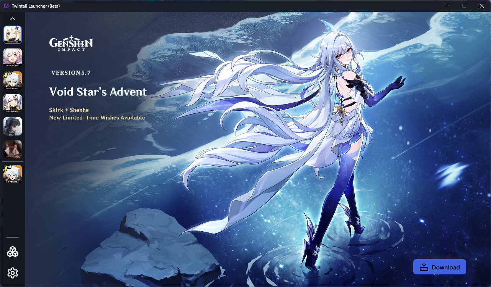
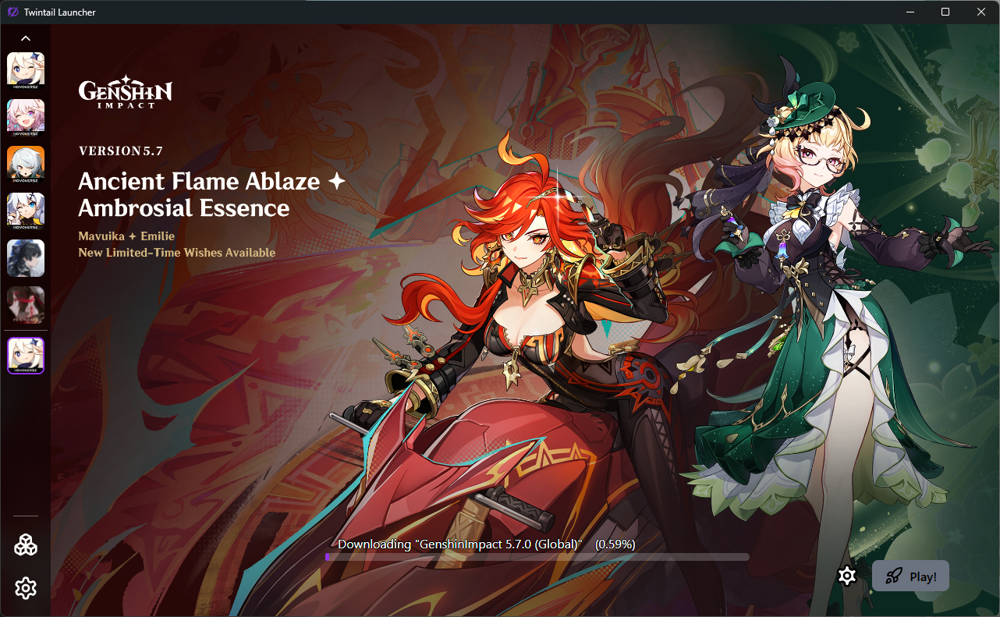
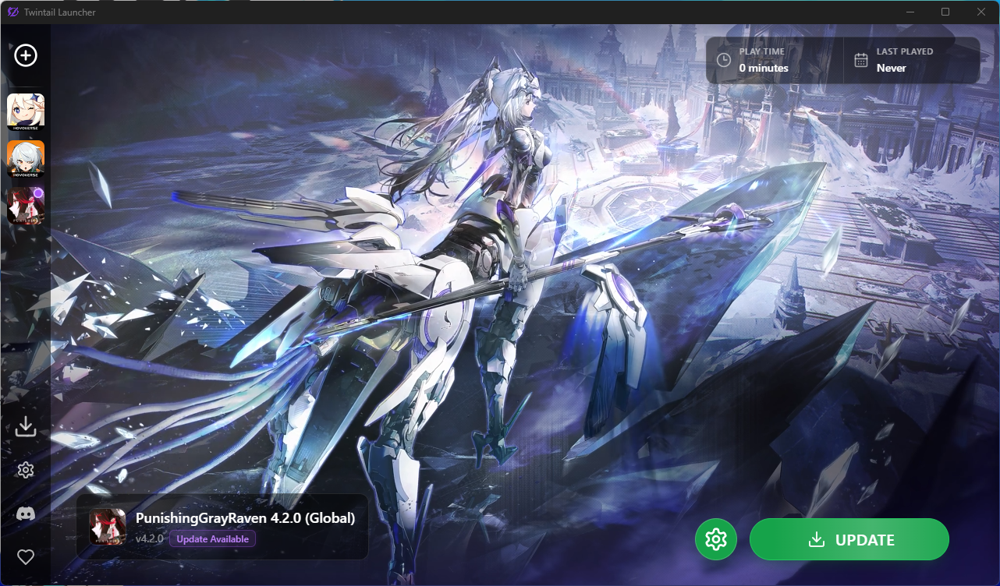
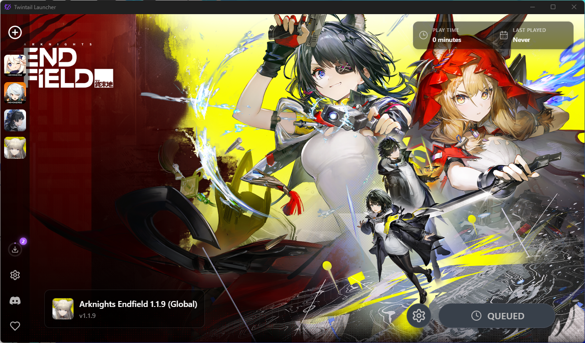
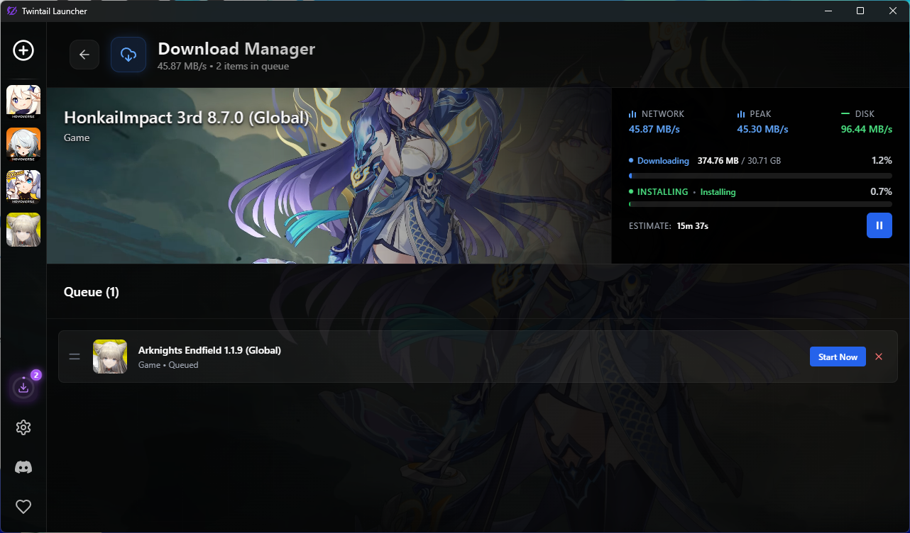
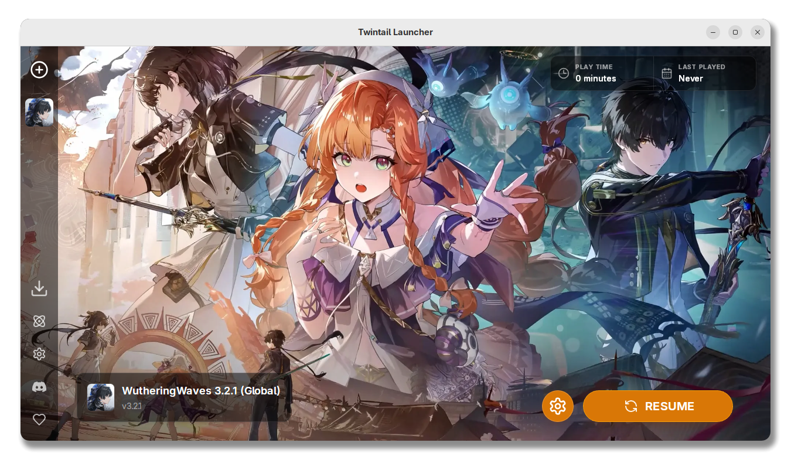
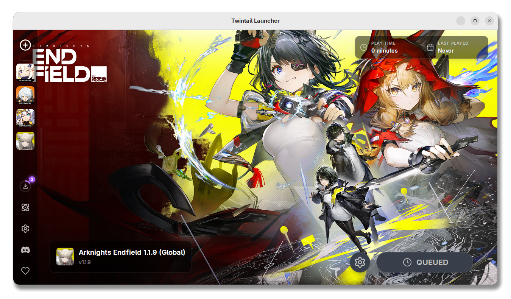
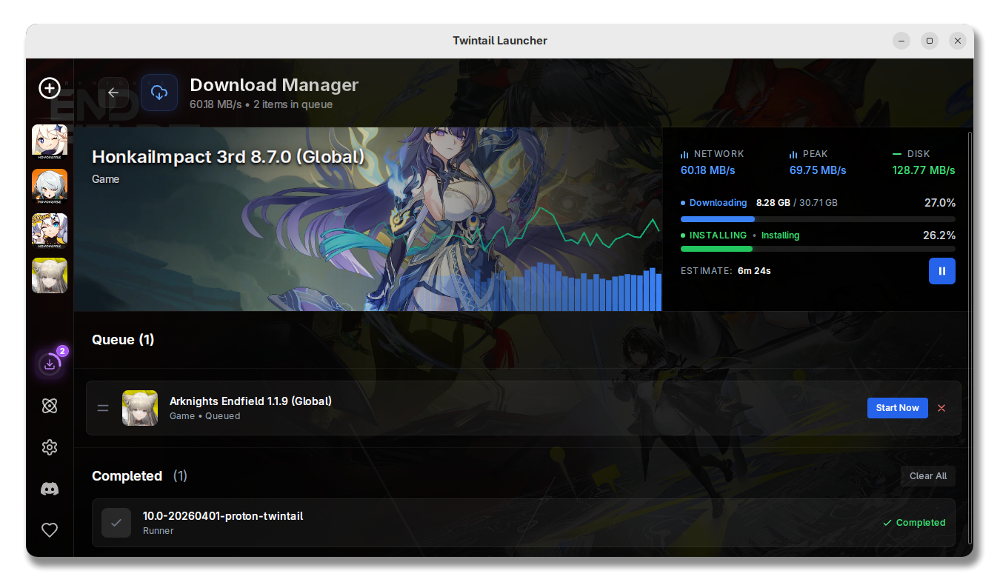

# TwintailLauncher
<!-- TOC -->
* [TwintailLauncher](#twintaillauncher)
  * [About](#about)
    * [Supported games](#supported-games)
    * [Is TTL safe to use? Can I get banned?](#is-ttl-safe-to-use-can-i-get-banned)
    * [Screenshots](#screenshots)
  * [Installation](#installation)
  * [Developers & Compiling](#developers--compiling)
    * [Prerequisites](#prerequisites)
    * [Building](#building)
  * [Sponsors](#sponsors)
  * [Thanks to our contributors](#thanks-to-our-contributors)
  * [Issues and contributions](#issues-and-contributions)
<!-- TOC -->

## About
Twintaillauncher is a multi-platform launcher that brings mod support, quality-of-life improvements, and advanced features to a variety of anime-styled games.<br>
TTL is an all-in-one tool for downloading, managing, and launching your favorite anime games. It’s designed with flexibility, ease of use, and customization in mind.

### Supported games
* Genshin Impact
* Honkai: Star Rail
* Honkai Impact 3rd
* Zenless Zone Zero
* Wuthering Waves
* Punishing: Gray Raven
* AetherGazer

### Is TTL safe to use? Can I get banned?
We do our best to ensure the launcher avoids detection and doesn't interfere with sensitive files or anti-cheat systems. However, some games require the Launcher to disable the anti-cheat to get them running (Linux only). So use TTL at your own risk.

### Screenshots

<details>
<summary>Windows</summary>








</details>

<details>
<summary>Linux</summary>






</details>

## Installation

| Platform                            | Link                                                                            | Note(s)                                              |
|-------------------------------------|---------------------------------------------------------------------------------|------------------------------------------------------|
| Windows (x64, Stable)               | [Winget](https://wingetgui.com/apps/TwintailTeam-TTL)                           | Installation is only supported via `winget`          |
| Linux (Flatpak, Stable)             | [Flathub](https://flathub.org/apps/app.twintaillauncher.ttl)                    | Recommended method for all distributions             |
| Linux (Copr, Stable)                | [Copr](https://copr.fedorainfracloud.org/coprs/tukandev/TwintailLauncher/)      | Fedora & Fedora based distributions                  |
| Linux (AUR, Unstable - From source) | [twintaillauncher-git](https://aur.archlinux.org/packages/twintaillauncher-git) | Use AUR helper (`yay` / `paru`)                      |
| Linux (AUR, Stable - From source)   | [twintaillauncher](https://aur.archlinux.org/packages/twintaillauncher)         | Use AUR helper (`yay` / `paru`)                      |
| Linux (AUR, Stable - From deb)      | [twintaillauncher-bin](https://aur.archlinux.org/packages/twintaillauncher-bin) | Use AUR helper (`yay` / `paru`)                      |
| Linux (DEB)                         | [Download](https://github.com/TwintailTeam/TwintailLauncher/releases/latest)    | **NOT RECOMMENDED** Used for AUR & Copr repositories |

## Developers & Compiling

### Prerequisites
* Rust (Install from [rustup](https://rustup.rs))
* Node.js (Install from [official website](https://nodejs.org/en/download))
* pnpm (Install from [official website](https://pnpm.io/installation))
* Protobuf (Install from [official website](https://protobuf.dev/installation/))
* Tauri (Follow [Tauri docs](https://tauri.app/start/prerequisites/))
* Cargo-xwin (Follow [Tauri docs](https://tauri.app/distribute/windows-installer/#experimental-build-windows-apps-on-linux-and-macos))

### Building
Install Node.js dependencies
```shell
pnpm install
```
Run for debugging
```shell
pnpm dev:tauri
```
Build for production (Current OS)
```shell
pnpm build:native
```
Build for production (Cross compile for Linux)
```shell
pnpm build:linux
```
Build for production (Cross compile for Windows)
```shell
pnpm build:windows
```
You can find built binaries in `target/release` for current os, `target/x86_64-unknown-linux-gnu` for linux cross compile and `target/x86_64-pc-windows-msvc` for windows cross compile.

## Sponsors

| Link                                              | Description          |
|---------------------------------------------------|----------------------|
| [SignPath Foundation](https://signpath.org/about) | Windows code signing |

## Thanks to our contributors

<a href="https://github.com/twintailteam/twintaillauncher/graphs/contributors">
  
</a>

## Issues and contributions
Feel free to open issues and PRs usually we try to get to everyone as fast as possible.<br>
Avoid opening multiple issues and please respect everyone's time we are all doing the work for free after all we are not required to answer and fix issues at all.
